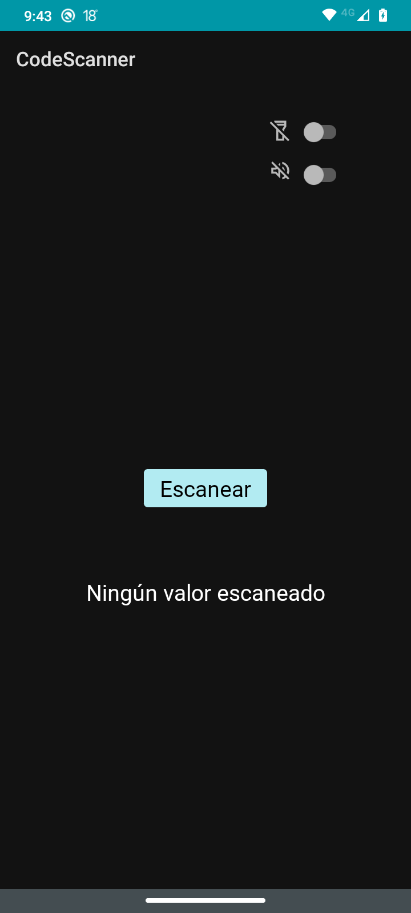
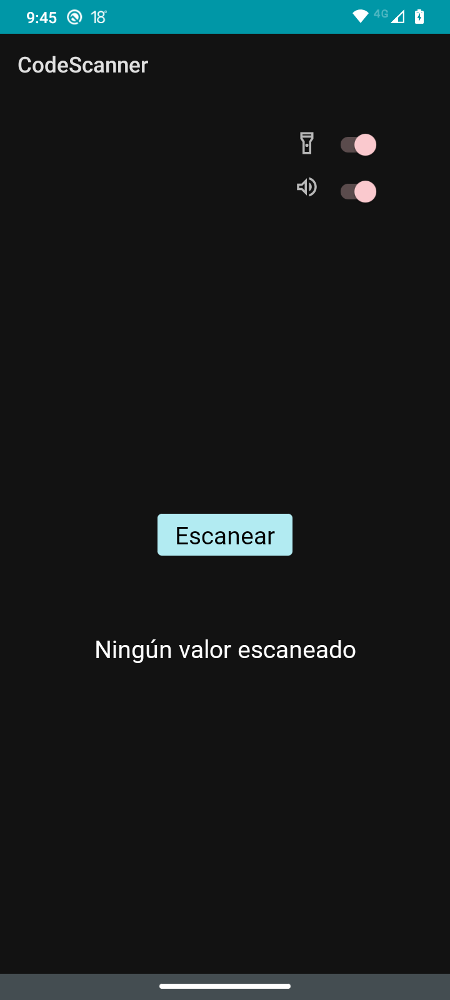
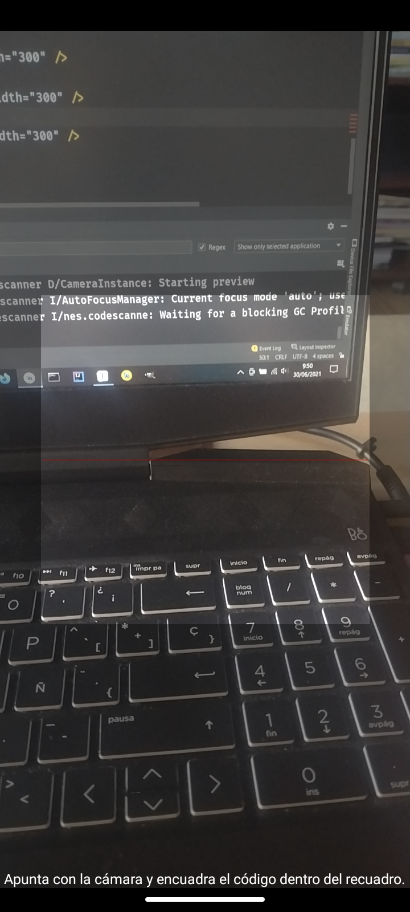
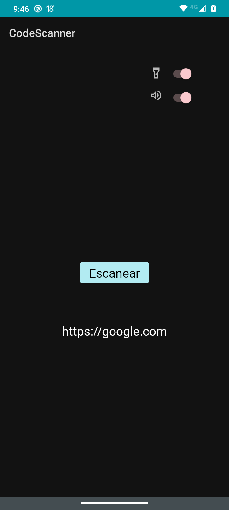

# Lector de códigos de barras y códigos QR

Basado en una adaptación de la librería [ZXING para Android](https://github.com/journeyapps/zxing-android-embedded)

## Configuración

En el archivo build.gradle del módulo app:

```groovy
android {
    compileOptions {
        sourceCompatibility JavaVersion.VERSION_1_8
        targetCompatibility JavaVersion.VERSION_1_8
    }
    kotlinOptions {
        jvmTarget = '1.8'
    }
    buildFeatures {
        viewBinding = true
    }
}

dependencies {
    // ZXING
    implementation("com.journeyapps:zxing-android-embedded:4.2.0") { transitive = false }
    // ZXING ror SDK < 24
    implementation "com.google.zxing:core:3.3.0"
}
```

En el archivo AndroidManifest.xml:

```xml
<uses-sdk tools:overrideLibrary="com.google.zxing.client.android" />

<application
    ...
    android:hardwareAccelerated="true">
...
</application>
```

## Notas

La propia librería ZXING gestiona los permisos para acceder a la cámara.









<figure class="video_container">
  <iframe src="https://www.youtube.com/embed/j-NcBbPmKgY" frameborder="0" allowfullscreen="true"> </iframe>
</figure>
